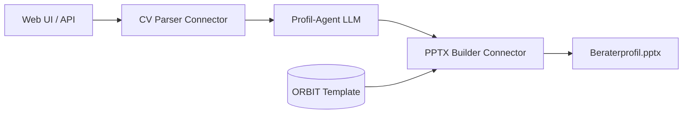

# ORBIT Beraterprofil Generator

Automatische Erstellung von **One-Pager Beraterprofilen** im ORBIT-PowerPoint-Template aus beliebigen CVs (PDF/DOCX).

## Architektur



### Komponenten

| # | Komponente | Typ | LLM? | Aufgabe |
|---|------------|-----|------|---------|
| 1 | **CV Parser** | Connector | Nein | PDF/DOCX → Rohtext (+ optional Foto aus DOCX) |
| 2 | **Profil-Agent** | Agent | **Ja** | Rohtext → strukturiertes JSON (Deutsch, ORBIT-Regeln) |
| 3 | **PPTX Builder** | Connector | Nein | JSON → festes Template, exakte Positionen |
| 4 | **Web API** | Orchestrator | Nein | Upload, Pipeline, Download |

**Empfehlung:** **1 Agent + 2 Connectors + 1 Orchestrator** (dieses Repo).

### Brauchen wir ein LLM?

**Ja.** Regelbasierte Extraktion reicht nicht für:
- Übersetzung EN → DE
- Domänen-Erkennung (Telecom vs. IT vs. Sales)
- Zusammenfassung / Summary in ORBIT-Tonalität
- Zuordnung von Skills zu festen Template-Kategorien

**DeepSeek** ist für JSON-Extraktion kostengünstig; **Mistral** als Fallback/alternative.

## Schnellstart (localhost)

### Streamlit UI (empfohlen — wie Beratorprofilv2)

```powershell
cd "C:\Personal\Agentic AI\Beratorprofilv3"
pip install -r requirements.txt
# .env mit DEEPSEEK_API_KEY / MISTRAL_API_KEY konfigurieren
.\start_app.ps1
```

Browser: http://localhost:8501

### FastAPI (API / einfaches HTML)

```powershell
python -m uvicorn app.main:app --reload --host 127.0.0.1 --port 8000
```

Browser: http://127.0.0.1:8000

## API

`POST /api/generate`
- `cv`: PDF oder DOCX (required)
- `photo`: JPG/PNG optional
- `provider`: `deepseek` | `mistral`

Antwort: JSON mit `download_url` und extrahiertem `profile`.

## Regeln & Prompts

- `rules/BERATERPROFIL_RULES.md` – extrahierte Formatregeln aus dem Template
- `rules/EXTRACTION_PROMPT.md` – System-Prompt für den LLM-Agenten

## Deployment (später)

- Docker + Azure App Service / VM / Render
- `.env` für API-Keys
- Template unter `templates/beraterprofil_template.pptx` versionieren

## Projektstruktur

```
app.py              # (removed — use streamlit_app.py)
streamlit_app.py    # Streamlit UI (ORBIT Design aus v2)
ui/                 # Streamlit Komponenten (styles, preview, settings)
app/
  main.py           # FastAPI
  pipeline.py       # Orchestrierung
  services/
    cv_parser.py    # Connector 1
    llm_agent.py    # Agent
    pptx_builder.py # Connector 2
rules/              # Gehirn / Regeln
templates/          # ORBIT PPTX Vorlage (example2 Layout)
samples/            # Beispiel-CVs
static/             # FastAPI HTML fallback
```
